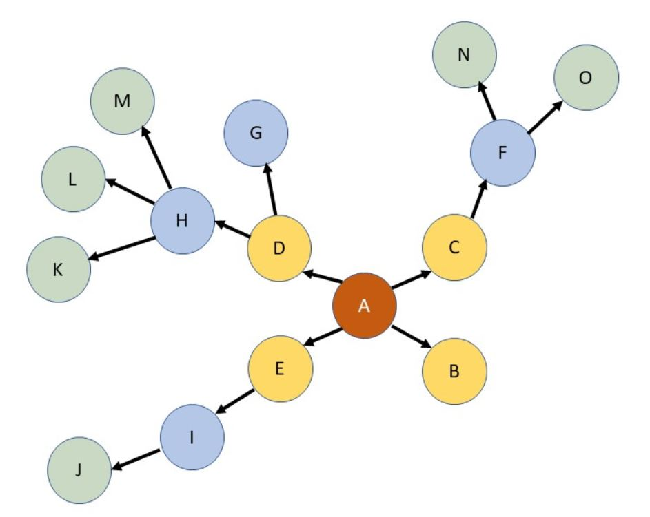
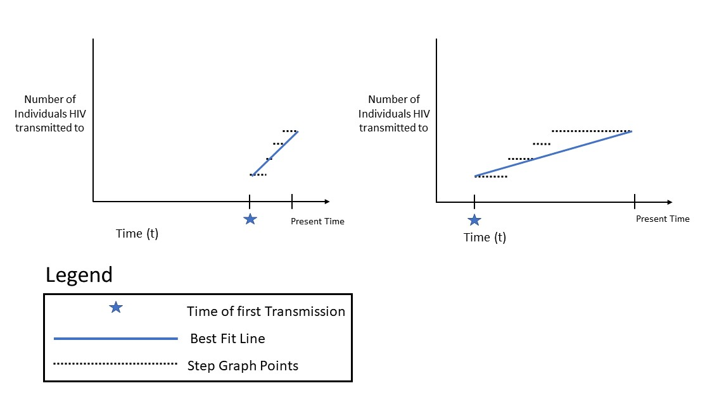
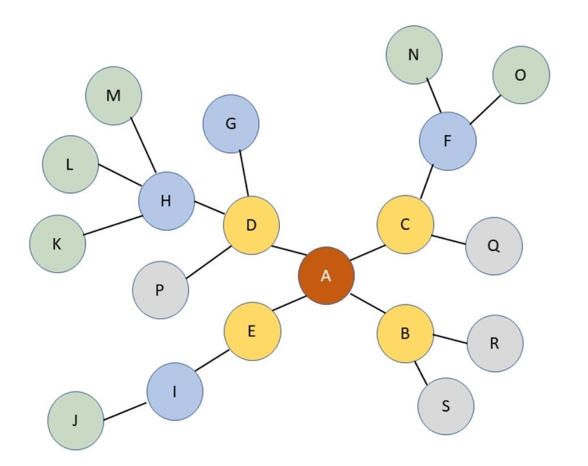

# SEPIA - SIMULATION-BASED EVALUATION OF PRIORITIZATION ALGORITHMS

SEPIA is a framework for comparing the accuracies of algorithms that prioritize individuals by risk of transmitting HIV (Human Immunodeficiency Virus).

## Installation Guide
SEPIA was written in Python 3 and is intended to be used through the bash interface.

-___Installation:___- Clone the master git repository

-___Dependencies to install:___-
```
sudo apt-get update
sudo apt-get install python3-pip
pip3 install numpy
pip3 install scipy
pip3 install matplotlib
pip3 install seaborn
```
-___External Packages to install:___- Located in ```efficacy_functions.py```.
```
from gzip inport open as gopen
from sys import stderr
import numpy as np
import scipy.stats as stats
import matplotlib.pyplot as plt
from itertools import repeat
```

## Methods

### Functions

- ___compute_efficacy.py___ - matches all individuals in the user's ordering along with the number of people each individual infected during a specified period of time. The user's ordering is maintained.

```
usage: [-h] [-m METRIC] [-i INPUT] [-o OUTPUT] [-t TRANMSISSIONHIST] [-c CONTACTNET] [-s START] [-e END]
  
  -h, --help            show this help message and exit
  
  -m METRIC, --metric METRIC
                        Metric of prioritization (1-6) (default: None)
  -i INPUT, --input INPUT
                        Input File - User's Ordering (default: stdin)
  -o OUTPUT, --output OUTPUT
                        Output File (default: stdout)
  -t TRANMSISSIONHIST, --tranmsissionHist TRANMSISSIONHIST
                        Tranmission History File (default: None)
  -c CONTACTNET, --contactNet CONTACTNET
                        Contact History File (default: None)
  -s START, --start START
                        Time Start (default: None)
  -e END, --end END     Time End (default: inf)

```

- ___compute_taub.py___ - computes the Kendall Tau-b correlation coefficient between the user's ordering and the optimal ordering (which is sorted in descending order).

```
usage: [-h] [-i INPUT] [-o OUTPUT] [-r]
  
  -h, --help            Show the help message and exit
  
  -i INPUT, --input INPUT
                        Input File (User ordering of individuals paired with their counts) 
                        (default: stdin)
  
  -o OUTPUT, --output OUTPUT
                        Output File (Tau-b correlation coefficient, along with calculated p-value)
                        (default: stdout)

  -r 
                        Reverses the optimal ordering if flag set. (Optimal ordering is sorted in 
                        ascending order).
```

- __make_violinplots.py__ - creates 9 violin plot figures in ```\figs```, each with with 2 violin plots. Each figure represents an experimental condition, and each of the 2 plots represent either ProACT or HIV-TRACE.

```
usage: [METRIC]
 METRIC			The metric you want to generate violin plots for with the data
```
-__efficacyFunctions.py__- defines several functions used in the scripts above.

## **Metrics**

We have implemented six distinct metrics to generate optimal orderings, with each defining a unique way of calculating the coutn values of individuals such that individuals with higher counts will have higher priority in the ordering.

### **1. Direct Transmissions**
In this metric, each individual's count is calculated as the number of individuals that they have directly (one edge away) transmitted HIV to.

The below figure illustrates an example transmission network, with arrows indicating a transmission from one person (node) to another:



In this example, Person A has four outgoing edges, indicating that Person A transmitted HIV to four people and has a direct transmission count of 4. Similarly, Person B has no outgoing edges, so Person B's count is 0.

### **2. Best Fit Graph**
In this metric, each individual's count is calculated as the slope of a best-fit line plotted in a step graph of all of the individual's outgoing transmissions over a specified time period on the horizontal axis. The line of best-fit starts at the event of the individual first transmitting HIV to someone else; this aims to prioritize individuals that transmit HIV to more people over a short time period, as they will have steeper slopes. 

With this metric, we hope to take into account that individuals who transmit HIV to others more recently should have higher priority than individuals who transmitted HIV to others longer ago.  

The following figure shows the resulting lines of best-fit for two cases: 



The graph on the left represents a case in which the individual started transmitting HIV more recently, whereas the graph on the right represents a case in which the individual had multiple outgoing transmissions early in the time period but stopped towards the middle. This design thus gives higher priority to the individual represented by the left side with multiple recent outgoing transmissions, as their slope is greater.

### **3. Indirect Transmissions**
This metric extends Metric 1 in order to analyze an individual's greater impact on the community. 

Each individual's count is calculated as the cumulative number of individuals they indirectly (more than 1 edge away) transmitted HIV to for up to any given number of degrees away. 


For instance, in the example transmission network shown above, Person A (highlighted in red) directly transmitted HIV to Persons B, C, D, and E (highlighted in yellow), who then transmitted HIV to Persons F, G, H, and I (highlighted in blue), who then transmitted HIV to Persons J, K, L, M, N, and O (highlighted in green). Thus, given the number of degrees away = 2 (2 edges away in the figure), Person A's indirect transmission are F, G, H, and I, which sums to a count of 4. Similarly, given the number of degrees away = 3, Person A's indirect transmissions are F, G, H, I, J, K, L, M, N, and O, for a count of 10. 

### **4. Total Transmissions** 
This metric merges Metrics 1 and 3 to take into account each individual's direct and indirect transmissions. 

Each individual's count is calculated as the cumulative number of individuals that they have directly (1 edge away) and indirectly (2+ edges away) transmitted HIV to for up to any given number of degrees away.


In this example, at 2 degrees away, Person A (highlighted in red) has 4 direct transmissions (to Persons B, C, D, and E) and 4 indirect transmissions (to Persons F, G, H, and I) for a total count of 8. Similarly, at 3 degrees away, Person A has 4 direct transmissions and 10 indirect transmissions (Persons F, G, H, I, J, K, L, M, N, O) for a total count of 14.

### **5. Number of Contacts**:
This metric measures an individual's priority based on their number of contacts, with an edge in a contact network existing between any two individuals who have a relationship through which HIV may be transmitted.

The figure below illustrates an example contact network corresponding to the transmission network in previous examples:



In this example, Person A has undirected edges between themself and Persons B, C, D, and E, so Person A has a count of 4. Similarly, Person B has indirected edges between themself and Persons A, R, and S, so Person B has a count of 3.

### **6. Number of Contacts and Transmissions**
This metric combines Metrics 1 and 5 in order to take into account each individual's number of direct transmissions and number of contacts. 

Below are the transmission (left) and contact (right) networks:


In this example, Person D has direct transmissions to Persons G and H, and is in contact with Persons A, G, H, and P, so Person D has a total count of 6. 

## **Example Commands**
This command calls compute_efficacy.py, choosing Metric 1 and uses the file 01.currOptimal5.txt as the ordering of individuals generated by an algorithm. The file the results are outputted to is test.txt and the transmission network is passed in with 01.transmissions.txt. The simulation time starts at time 9 and ends at time 10.
```
python3 compute_efficacy.py -m 1 -i Sample_Dataset_1/01.currOptimal5.txt -o test.txt -t Sample_Dataset_1/01.transmissions.txt -s 9 -e 10        	
```

This command calls make_violinplots.py which will generate violin plots for Metric 1 by comparing the ordering in Metric 1 to the orderings of ProACT and HIV-Trace. 
```
python3 make_violinplots.py 1
```
